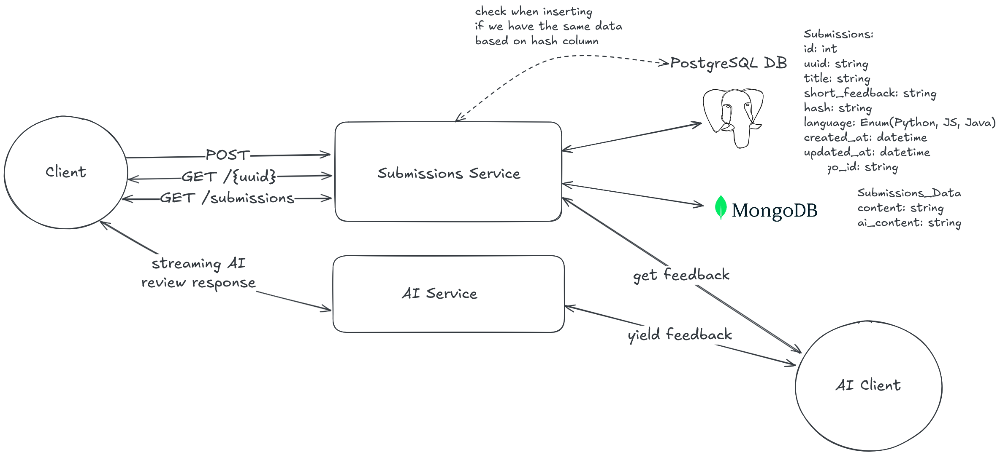
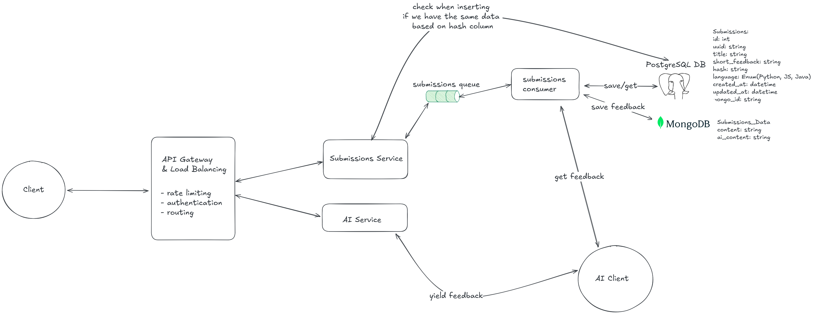

# Brief info
The purpose of this app is to store code submissions and call AI service to gather some feedback in order to improve these submissions.

We also have the functionality to stream AI response without making a submission.

# Development Setup with Docker Compose

This project provides a ready-to-use **development environment** with Docker and Docker Compose.  
It runs the application along with its dependencies in containers.

## Prerequisites

- [Docker](https://docs.docker.com/get-docker/) installed  
- [Docker Compose](https://docs.docker.com/compose/install/) installed  

## Getting Started

1. Copy the environment example file and adjust values as needed:

   ```bash
   cp .env.example .env

2. Build and start the services:

    ```bash
    docker-compose up --build
3. Access the application:

- API: http://localhost:8000
- API docs: http://localhost:8000/docs


# Documentation

## Why PostgreSQL + MongoDB

Our system uses a **hybrid storage strategy**:  
- **PostgreSQL** for structured metadata  
- **MongoDB** for flexible payloads  

---

## PostgreSQL (Relational, Structured Data)
**Stores:**  
- `uuid`, `title`, `hash`, `language`, `created_at`, `updated_at`, `mongo_id`

**Why:**  
- Strong constraints & indexing (UUID, unique hashes, enums)  
- Efficient queries (search by title, language, recent submissions)  
- Lightweight listing without large payloads  

---

## MongoDB (Document Store, Flexible Data)
**Stores:**  
- `content` (user code)  
- `ai_response` (AI feedback)

**Why:**  
- Handles large, variable, and evolving payloads  
- No schema migrations needed for changes
- Payload fetched only when needed, improving performance  

---

## How They Work Together
1. **Create:** payload → MongoDB, metadata + `mongo_id` → PostgreSQL
2. **Get:** metadata from PostgreSQL, payload (if needed) from MongoDB
3. **List:** only PostgreSQL queried for efficiency

---

- **PostgreSQL** = source of truth (fast, consistent)  
- **MongoDB** = payload storage (flexible, scalable)

## Diagram



## Potential Deep Dives
